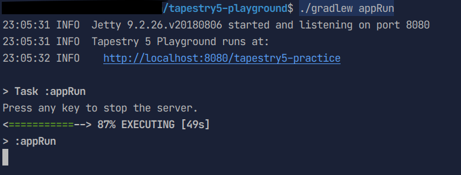
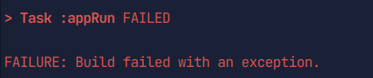

### What's this?
javaのWebアプリケーションフレームワーク
[tapestry](https://tapestry.apache.org/index.html) のサンプルプロジェクトです。

諸般の事情で`5.1.0.0`に準拠しています。

### 実行環境
jdk8

### 実行方法
`./gradlew appRun`

http://localhost:8080/tapestry5-practice にアクセスする

ポートを変えたい場合は、`build.gradle`のgretty->httpPortを変えてください。

#### デバッグ実行
`./gradlew appRunDebug`\
デフォルトでは5005ポートで接続することができます。\
デバッグポートを変えたい場合は、`build.gradle`のgretty->debugPortを変えてください。

##### 自動更新
ソースファイルを編集すると自動で更新されます。
更新されると以下のような例外が標準出力に表示されますが気にする必要はありません。

##### 停止方法
ターミナル上でエンターキーを押してください。
自動更新が一度でも行われていると以下のようなエラーが出ますが問題ありません。
ただし、8080ポートがすぐに開放されないことがあるので、
再度`./gradlew appRun`を実行する前にしばらく待ってください。

正規の方法以外でプロセスを止めると8080ポートが開放されないことがあります。
その場合は8080ポートを使用しているプロセスを直接止めてください。

###### あるポートを使用しているプロセスの調べ方(Windows)
`netstat -ano | find '":8080"'` (Powershell)\
`netstat -ano | find ":8080"` (cmd)

###### あるプロセスIDのプロセスを強制終了する(Windows)
`taskkill /F /PID <プロセスID>`

### TODO
- [x] page activation
- [x] component event
    - [x] handler
    - [x] response
- [ ] components
    - [ ] control
        - [x] if
        - [ ] unless
        - [ ] loop
    - [ ] form
        - [ ] textfield
        - [ ] select
        - [ ] check
        - [ ] radio
        - [ ] textarea
    - [ ] block
    - [ ] zone
- [ ] persist